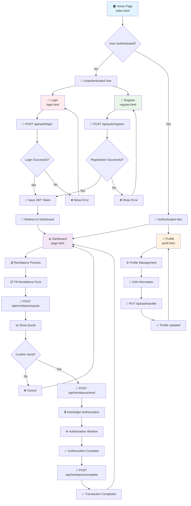
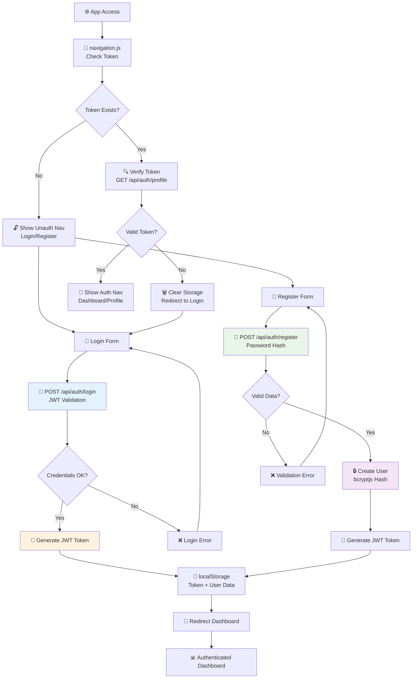
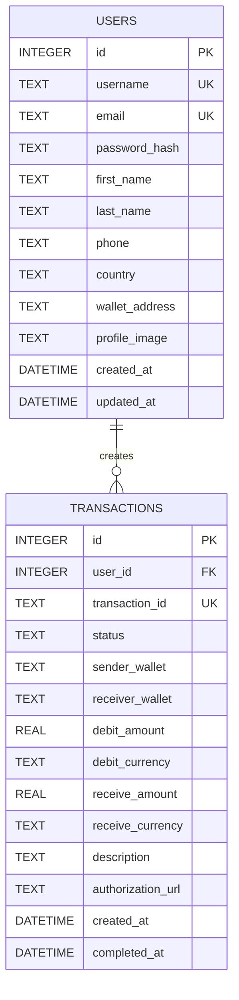
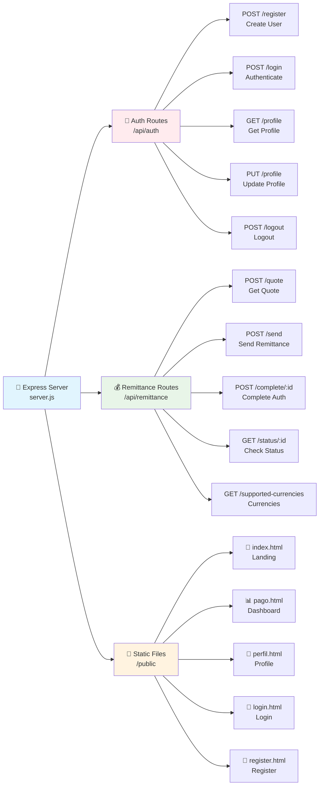
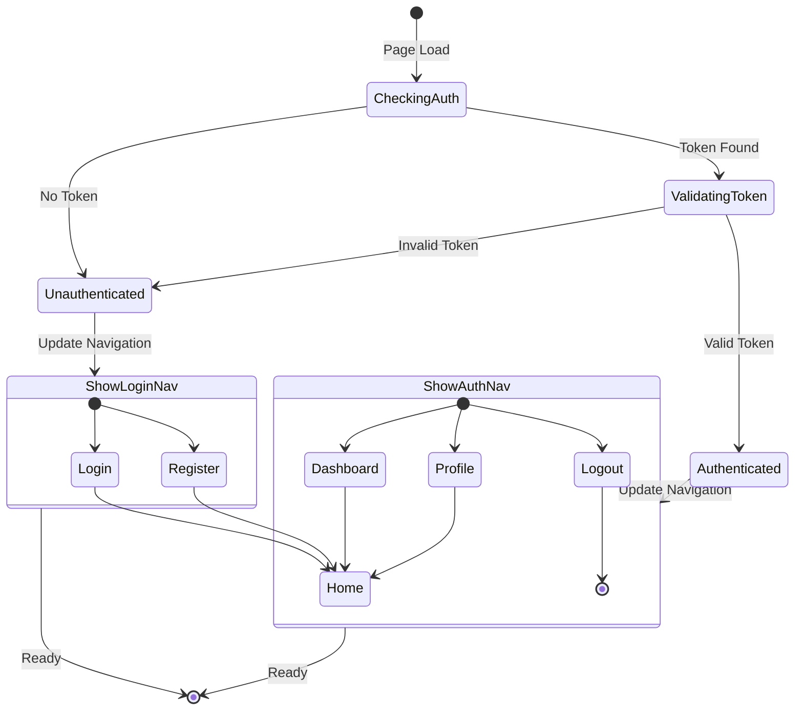
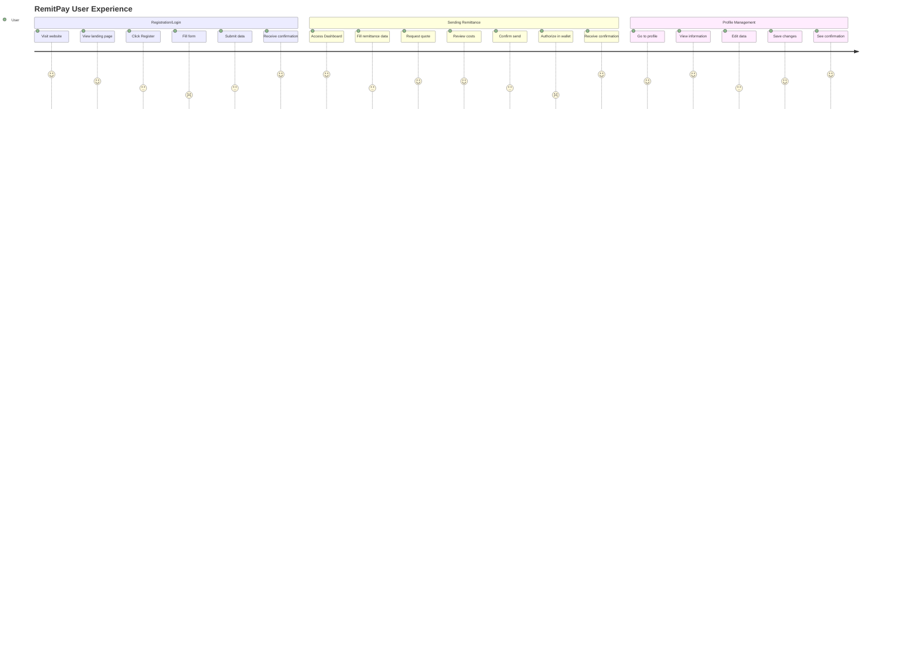
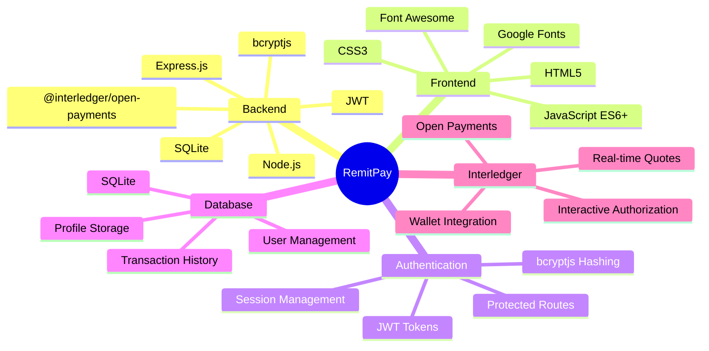

# Flow Diagram - RemitPay

## 🔄 Main Application Flow



## 🔐 Detailed Authentication Flow



## 💰 Interledger Transaction Flow

```mermaid
graph TD
    A[📊 Authenticated Dashboard] --> B[📝 Remittance Form]
    
    B --> C[🔄 Transform Wallets<br/>app.js validation]
    C --> D[💱 Request Quote<br/>POST /api/remittance/quote]
    
    D --> E[🏦 Get Wallet Info<br/>Interledger Client]
    E --> F[💹 Calculate Exchange Rate]
    F --> G[📊 Show Quote to User]
    
    G --> H{User Confirms?}
    
    H -->|No| I[❌ Cancel Transaction]
    H -->|Yes| J[🚀 Start Send<br/>POST /api/remittance/send]
    
    J --> K[🔐 Create Outgoing Payment Grant]
    K --> L[🌐 Interactive Authorization URL]
    L --> M[🖥️ Open Auth Window<br/>window.open()]
    
    M --> N[👤 User Authorizes in Wallet]
    N --> O[🔄 Auto Verification<br/>Polling every 5s]
    
    O --> P{Grant Authorized?}
    
    P -->|No| Q[⏳ Keep Waiting]
    P -->|Yes| R[💸 Create Outgoing Payment]
    
    R --> S[📋 Create Incoming Payment]
    S --> T[💰 Execute Transfer]
    T --> U[✅ Transaction Completed]
    
    Q --> O
    I --> A
    U --> V[📊 Update UI Status]
    V --> W[📚 Transaction History]
    
    style D fill:#e3f2fd
    style K fill:#fff3e0
    style R fill:#e8f5e8
    style T fill:#f3e5f5
```

## 🗄️ Database Architecture



## 🌐 API Routes Structure



## 🔄 Navigation State Management



## 📱 User Interaction Flow



## 🔧 Technologies and Dependencies



---

## 📋 Feature Summary

### ✅ **Implemented Features:**

1. **🔐 Complete Authentication System**
   - User registration and login
   - Password encryption with bcryptjs
   - JWT tokens for secure sessions
   - Dynamic navigation based on auth state

2. **💰 Interledger Remittance System**
   - Real-time quotes
   - Interactive authorization
   - Multi-currency support
   - Transaction history

3. **👤 User Profile Management**
   - Editable personal information
   - Wallet configuration
   - User statistics
   - Custom avatar

4. **🗄️ SQLite Database**
   - User storage
   - Transaction history
   - Persistent profile data

5. **🌐 Responsive Web Interface**
   - Modern glassmorphism design
   - Intuitive navigation
   - Validated forms
   - Feedback messages

### 🎯 **Typical User Flow:**

1. **New User**: Home → Register → Dashboard → Send Remittance
2. **Existing User**: Home → Login → Dashboard → Manage Profile
3. **Transaction**: Dashboard → Form → Quote → Authorization → Completed

---

*This diagram shows the complete RemitPay architecture, including authentication, Interledger transactions, user management, and the complete user experience.*